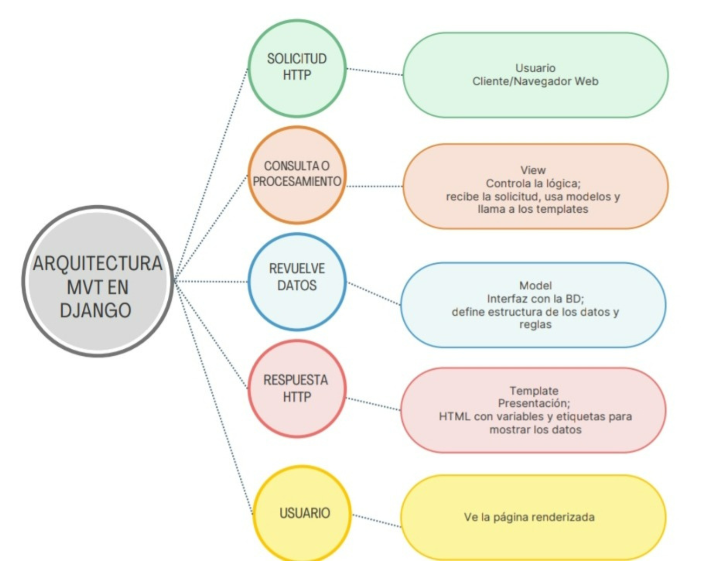
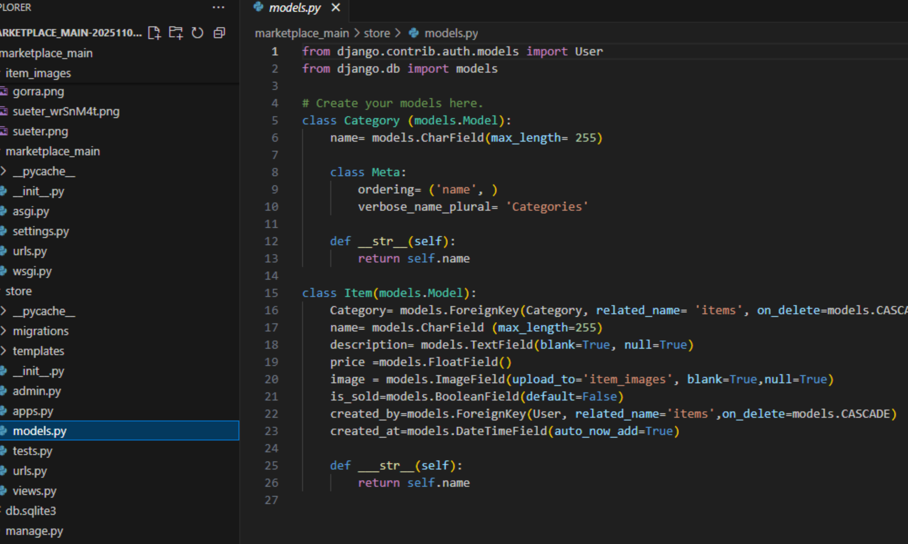
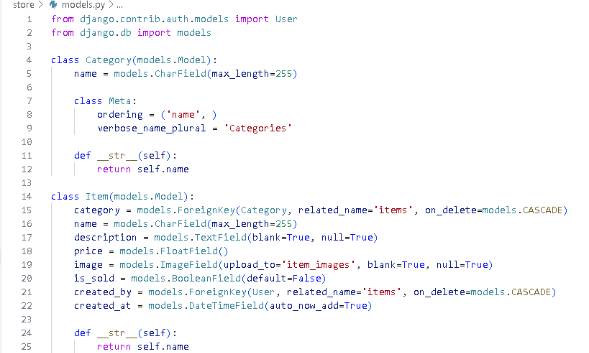
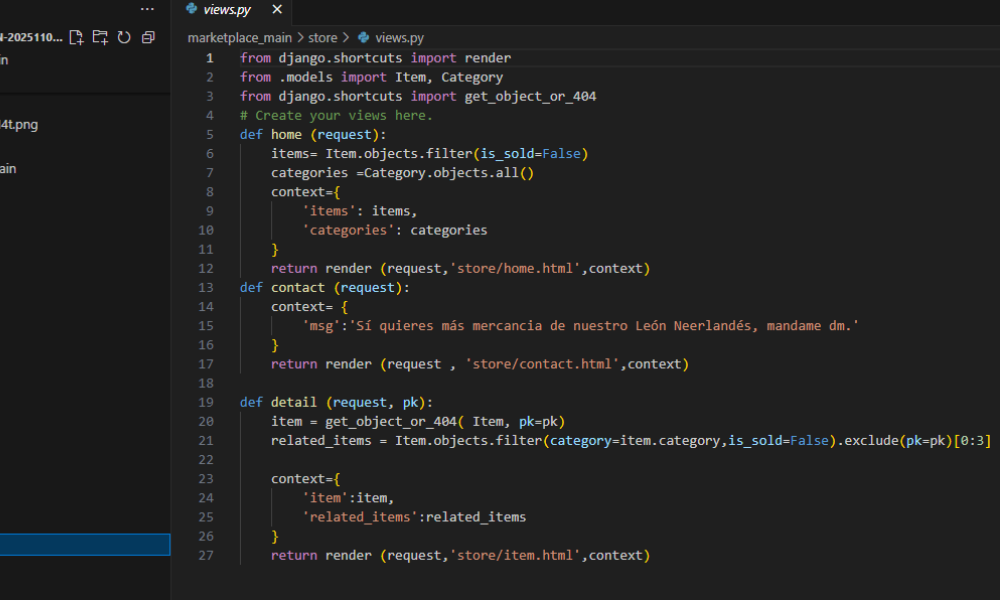
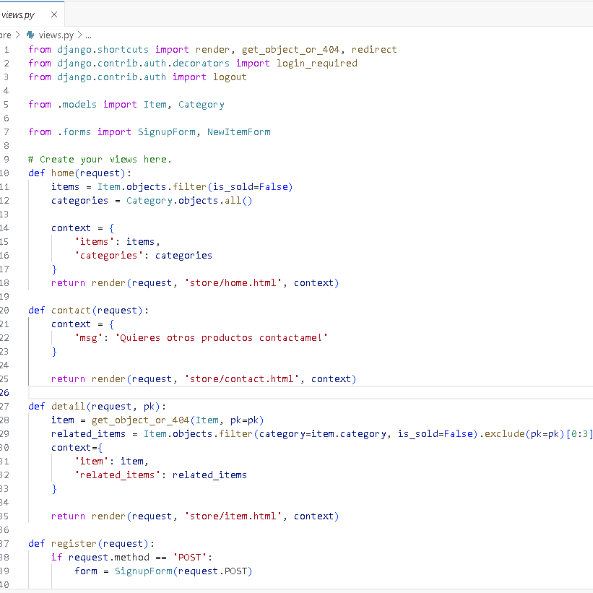
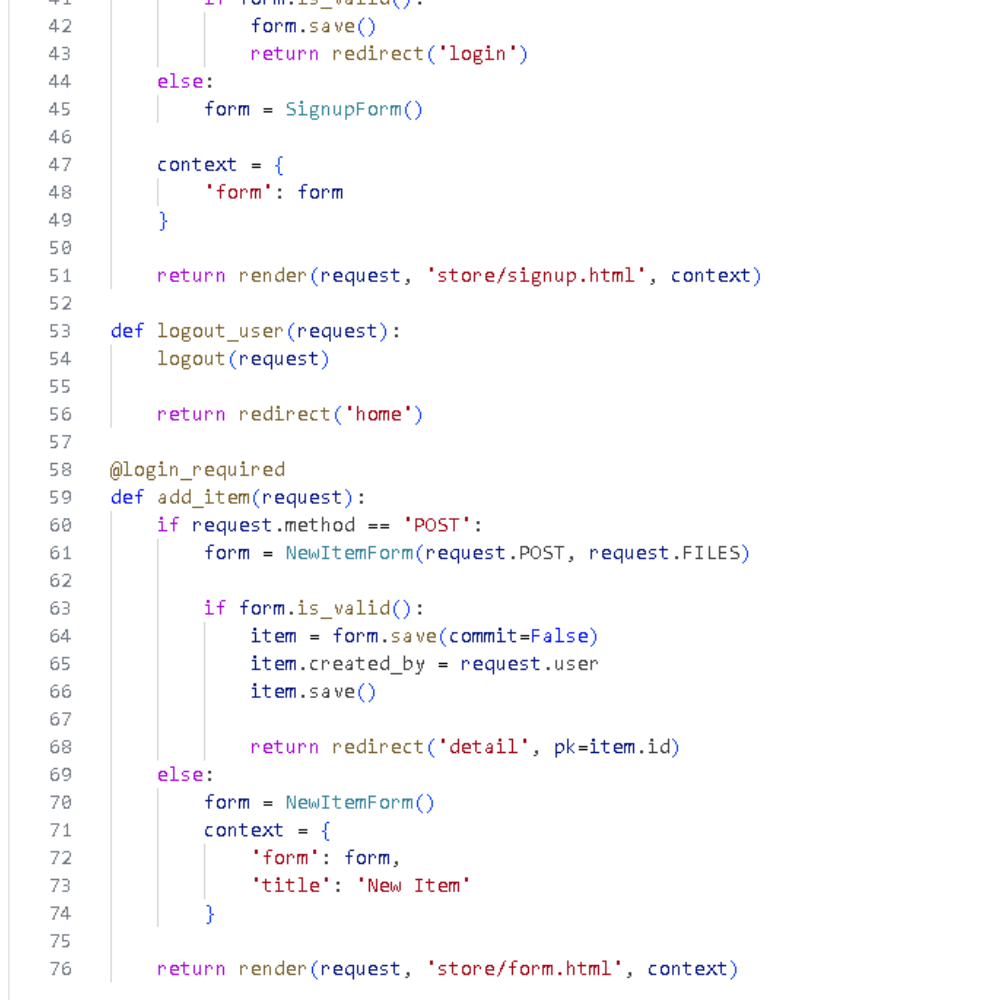
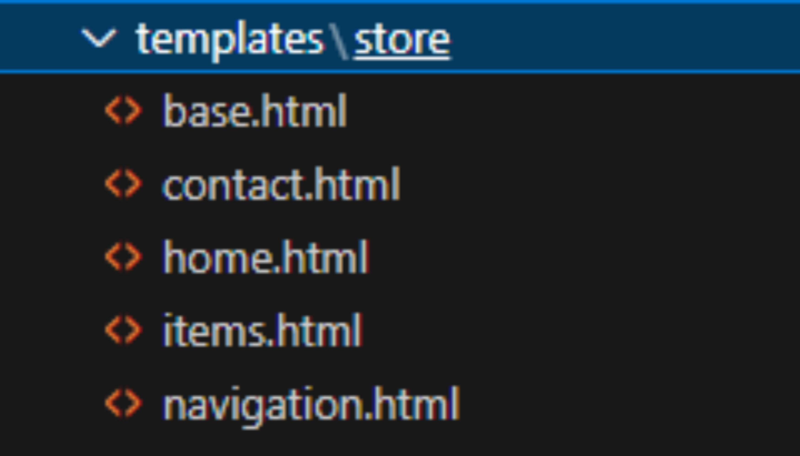
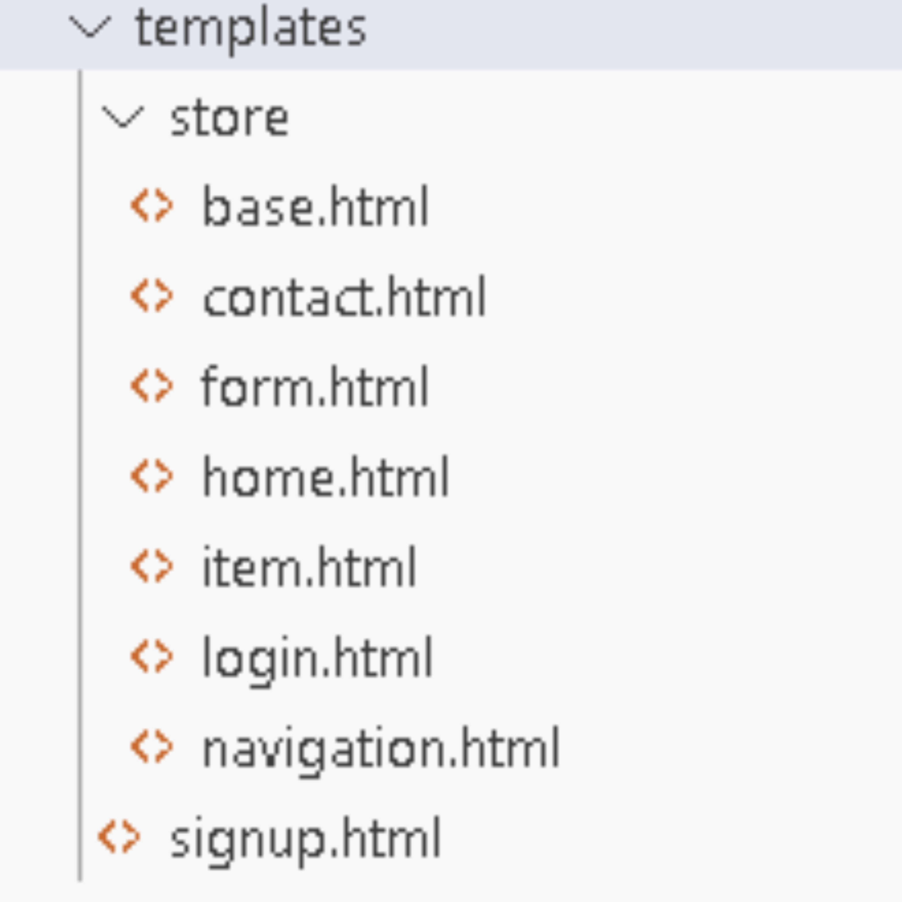

  <table width="100%">
    <tr>
      <td align="left" width="150">
       
      </td>
    </tr>
  </table>

<h1 align="center">Construye aplicaciones web</h1>

<h2 align="center">Integrantes</h2>

<ul style="list-style-position: inside;">
  <li>Aparicio Hernandez Joselin</li>
  <li>Huerta Cortes Melanie Johanna</li>
  <li>Mejía Cruz Heidy Clarisa</li>
  <li>Rodriguez Rodriguez Fatima</li>
  <li>Salazar Acosta Layla Jayri</li>
</ul>

<h2 align="center">5 AM PG</h2>

<h2 align="center">Índice</h2>

<ul style="list-style-position: inside;">
  <li>Introducción</li>
  <li>Explicación de los comandos</li>
  <li>Diagrama</li>
  <li>Explicación de los archivos</li>
  <li>Código de los archivos</li>
  <li>Ejecución final de lo que va del proyecto</li>
  <li>Conclusión</li>
</ul>

---

<h2 align="center">Introducción</h2>

En este semestre seguimos utilizando la herramienta Django que sirve para desarrollar aplicaciones porque ofrece rapidez, seguridad, escalabilidad y una gran comunidad de soporte.  
Es un framework de alto nivel que simplifica tareas comunes y permite construir proyectos muy grandes con menos esfuerzo.  
Django utiliza la arquitectura MVC (Modelo-Vista-Controlador), un patrón de diseño que separa una aplicación en tres componentes principales para mejorar la organización, mantenimiento y escalabilidad del código.  

---

<h2 align="center">Explicación de Comandos</h2>

<ul style="list-style-position: inside;">
  <li><b>cd Documents</b> → Entra a la carpeta Documentos desde la terminal.</li>
  <li><b>md "tu nombre"</b> → Crea una nueva carpeta con el nombre indicado.</li>
  <li><b>cd "tu nombre"</b> → Entra a la carpeta creada.</li>
  <li><b>md Proyectos</b> → Crea una carpeta llamada Proyectos.</li>
  <li><b>cd Proyectos</b> → Entra a la carpeta Proyectos.</li>
  <li><b>md dj_marketplace</b> → Crea una carpeta llamada dj_marketplace.</li>
  <li><b>cd dj_marketplace</b> → Entra a la carpeta dj_marketplace.</li>
  <li><b>python -m venv venv</b> → Crea un entorno virtual.</li>
  <li><b>venv\Scripts\activate</b> → Activa el entorno virtual.</li>
  <li><b>pip install django</b> → Instala Django.</li>
  <li><b>django-admin startproject marketplace_main</b> → Crea un proyecto Django.</li>
  <li><b>cd marketplace_main</b> → Entra al proyecto.</li>
  <li><b>python manage.py runserver</b> → Inicia el servidor local.</li>
  <li><b>ctrl + c + c</b> → Detiene el servidor.</li>
  <li><b>code .</b> → Abre el proyecto en VS Code.</li>
  <li><b>pip install Pillow</b> → Instala la librería Pillow.</li>
  <li><b>python manage.py migrate</b> → Aplica migraciones en la base de datos.</li>
  <li><b>python manage.py createsuperuser</b> → Crea un usuario administrador.</li>
  <li><b>python manage.py runserver</b> → Vuelve a iniciar el servidor.</li>
  <li><b>python manage.py makemigrations</b> → Crea archivos de migración.</li>
  <li><b>python manage.py startapp store</b> → Crea una aplicación llamada store.</li>
  <li><b>python manage.py changepassword</b> → Cambia la contraseña de un usuario.</li>
</ul>

---

<h2 align="center">Diagrama</h2>

<ul style="list-style-position: inside;">
  <li><b>Model</b> → Define cómo se estructuran y almacenan los datos.</li>
  <li><b>View</b> → Contiene la lógica del negocio.</li>
  <li><b>Template</b> → Se encarga de la presentación visual.</li>
</ul>

---

<h2 align="center">Explicación de Archivos</h2>

<ul style="list-style-position: inside;">
  <li><b>settings.py</b> → Configuración principal del proyecto.</li>
  <li><b>urls.py</b> → Conecta las rutas con las vistas.</li>
  <li><b>models.py</b> → Define los modelos y tablas de la base de datos.</li>
  <li><b>views.py</b> → Contiene la lógica de las páginas.</li>
  <li><b>templates/store</b> → Carpeta para las plantillas HTML de la aplicación.</li>
</ul>

---

<h2 align="center">Código de Archivos</h2>

<ul style="list-style-position: inside;">
  <li><b>Código de “models.py”:</b></li>
  
  
  
  <li><b>Código de “models.py” Actualizado:</b></li>
 
  

  El propósito de este código es definir la estructura de una base de datos que puede usarse para manejar categorías de productos y artículos asociados a esas categorías, incluyendo detalles como precio, descripción y estado de venta. Define el nombre de la categoría como un campo de texto con un máximo de 255 caracteres
Category: Una relación de clave foránea (FK) que conecta cada "Item" con una "Category". Esto significa que cada artículo pertenece a una categoría específica.

   <li><b>Código de “views.py” :</b></li>
  
  
  
  <li><b>Código de “views.py” aactualizado:</b>></li>
 
  
  
  
  Esta actualización nos gestiona  las páginas principales, los detalles de los productos, el registro de usuarios y la adición de nuevos artículos, por ejemplo con el request nos ayuda a visualizar home , login, register 
También se le hace llamado a SignupForm, NewItemForm que son clases de formularios de Django utilizadas para el registro de usuarios y para crear nuevos artículos.

 <li><b>Estructuras de “templates”:</b></li>
  
  
  
  <li><b>Estructuras de “templates” Actualizado:</b></li>
 
  

  El cambio refleja una ampliación en la funcionalidad del sitio web. Se han agregado plantillas para manejar la autenticación del usuario (inicio de sesión y registro) y formularios relacionados con el proceso de registro. Además, se reorganizó la estructura de las plantillas, moviendo todo a la carpeta “templates”.

  
  <li><b>settings.py</b> → Configuración de aplicaciones, middlewares y templates.</li>
  <li><b>urls.py</b> → Rutas para login, registro, logout y detalles de ítems.</li>
  <li><b>forms.py</b> → Formularios para login, registro y creación de productos.</li>
</ul>

---

<h2 align="center">Presentación Final</h2>

El proyecto tipo marketplace quedó funcional, con secciones esenciales como registro de usuarios, creación de productos, página de contacto y detalles individuales de artículos.  
La implementación en Django permitió desarrollar de manera eficiente, manteniendo separación de responsabilidades y un código organizado.  

---

<h2 align="center">Conclusión</h2>

La práctica consolidó conocimientos en desarrollo web backend con Django y las mejores prácticas de la línea de comandos.  
Se logró entregar una solución operativa de marketplace, reforzando la importancia de la arquitectura MVT y el uso de herramientas modernas para proyectos escalables.  

