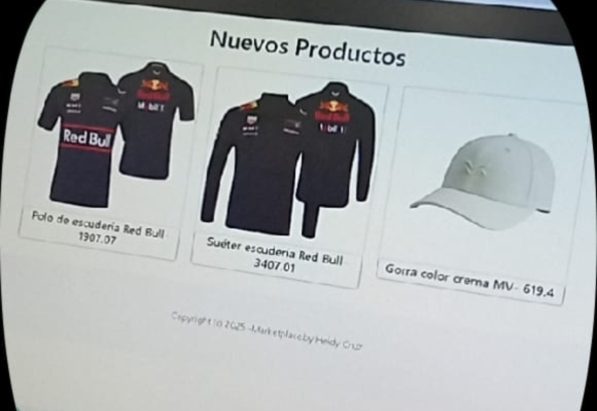
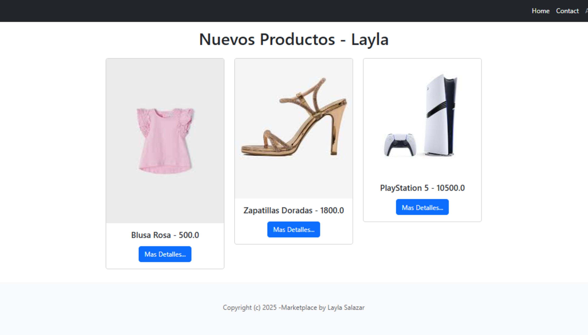
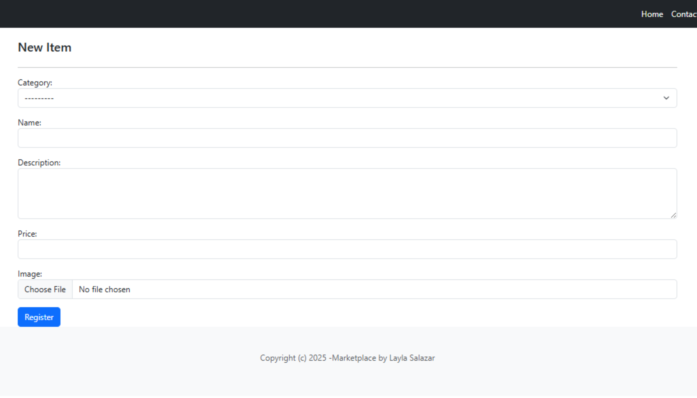
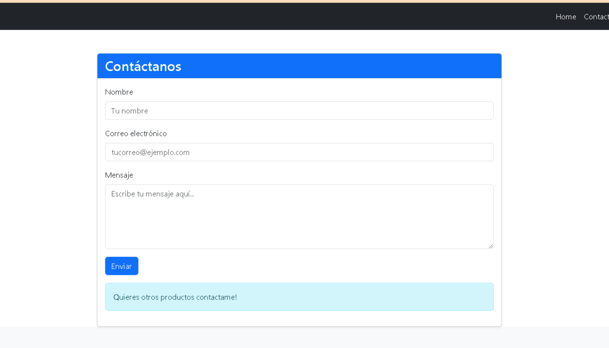
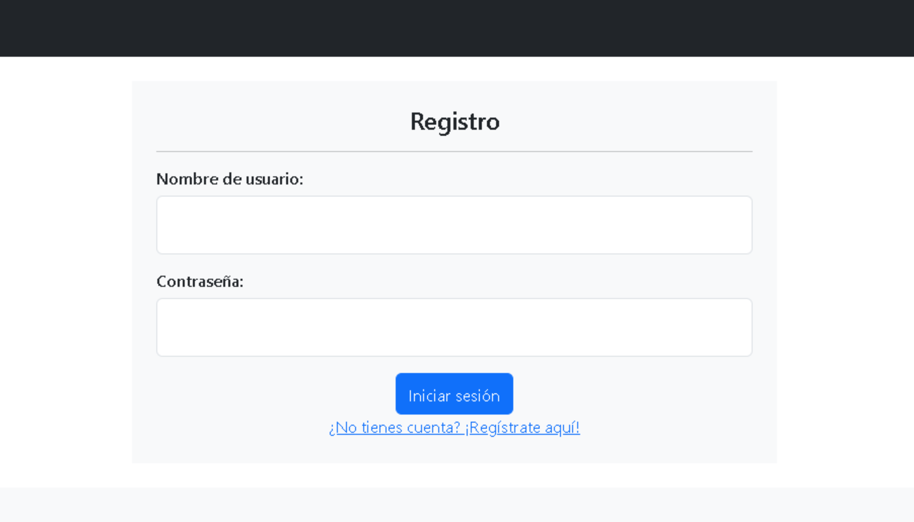
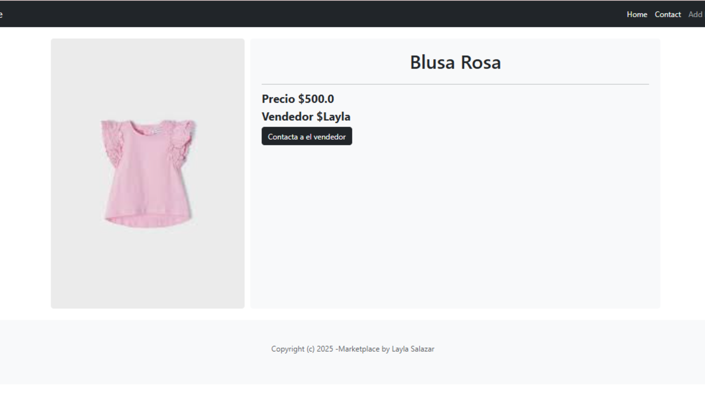
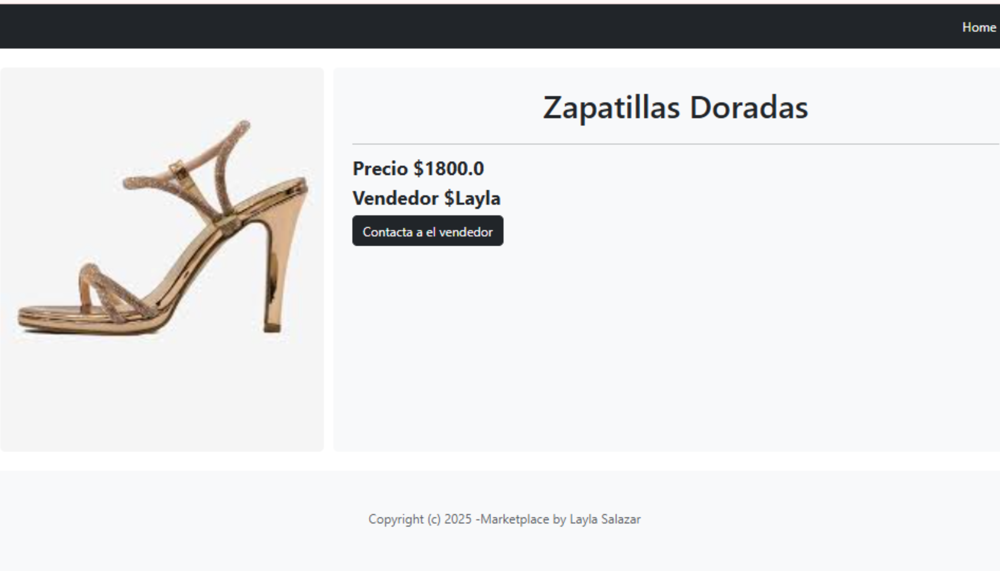
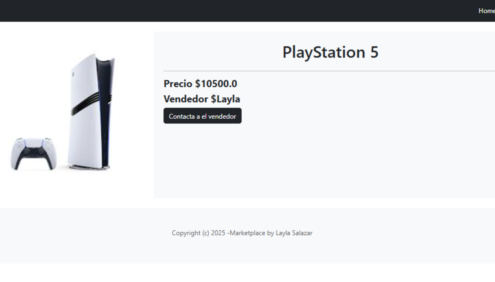

<div style="margin-left: 40px; margin-right: 40px;">
  <table width="100%">
    <tr>
      <td align="left" width="150">
       
      </td>
    </tr>
  </table>
</div>

<h1 align="center">Construye aplicaciones web</h1>

<h2 align="center">Integrantes</h2>

<div style="margin-left: 40px; margin-right: 40px; text-align: center;">
<ul style="list-style-position: inside;">
  <li>Aparicio Hernandez Joselin</li>
  <li>Huerta Cortes Melanie Johanna</li>
  <li>Mejía Cruz Heidy Clarisa</li>
  <li>Rodriguez Rodriguez Fatima</li>
  <li>Salazar Acosta Layla Jayri</li>
</ul>
</div>

<h2 align="center">5 AM PG</h2>

<h2 align="center" id="indice">Indice</h2>

<div style="margin-left: 40px; margin-right: 40px; text-align: center;">
<ul style="list-style-position: inside;">
  <li><a href="#introduccion">Introducción</a></li>
  <li><a href="#explicacion-de-comandos">Explicación de comandos</a></li>
  <li><a href="#diagrama">Diagrama</a></li>
  <li><a href="#explicacion-de-los-archivos">Explicación de los archivos</a></li>
  <li><a href="#codigo-de-los-archivos">Código de los archivos</a></li>
  <li><a href="#presentacion-final-actualizada">Presentación Final Actualizada</a></li>
  <li><a href="#conclusion">Conclusión</a></li>
</ul>
</div>

---

<h2 align="center" id="introduccion">Introducción</h2>
<p>

<div style="margin-left: 40px; margin-right: 40px; text-align: center;">
En este semestre seguimos utilizando la herramienta Django que sirve  para desarrollar aplicaciones porque ofrece rapidez, seguridad, escalabilidad y una gran comunidad de soporte. Es un framework de alto nivel que simplifica tareas comunes y permite construir proyectos muy grandes con menos esfuerzo que utiliza la arquitectura MVC Modelo-Vista-Controladores un patrón de diseño que separa una aplicación en tres componentes principales para mejorar la organización, mantenimiento y escalabilidad del código, que fue lo que empezamos a ver desde el primer dia que dividimos en modelo que se encarga de manejar la llamada lógica de negocios y la base de datos, el vista que es el encargada de la interfaz que observa el usuario , mostrar los datos del modelo y recibir los nuevos datos, y por último el controlador maneja las dos partes la de recibir las acciones, las interpreta y con ellas actualiza a al modelo o a la vista según se requiera.  
</div>
</p>
<p align="center"><a href="#indice">Regresar al índice</a></p>

---

<h2 align="center" id="explicacion-de-comandos">Explicación de comandos</h2>
<p>

<div style="margin-left: 40px; margin-right: 40px; text-align: center;">
<ul style="list-style-position: inside;">
  <li><b>cd Documents</b> → Sirve para entrar a la carpeta Documentos desde la terminal o consola. Indica a la computadora que cambie a la carpeta Documentos.</li>
  <li><b>md "tu nombre"</b> → Crea una nueva carpeta con el nombre que coloques entre comillas.</li>
  <li><b>cd "tu nombre"</b> → Entra a la carpeta que acabas de crear.</li>
  <li><b>md Proyectos</b> → Crea una carpeta llamada Proyectos donde guardarás tus trabajos.</li>
  <li><b>cd Proyectos</b> → Entra a la carpeta Proyectos.</li>
  <li><b>md dj_marketplace</b> → Crea una nueva carpeta llamada dj_marketplace, que será el proyecto de Django.</li>
  <li><b>cd dj_marketplace</b> → Entra a la carpeta dj_marketplace.</li>
  <li><b>python -m venv venv</b> → Crea un entorno virtual llamado venv. Este entorno sirve para instalar librerías sin afectar otros proyectos.</li>
  <li><b>venv\Scripts\activate</b> → Activa el entorno virtual que acabas de crear.</li>
  <li><b>pip install django</b> → Instala el framework Django dentro del entorno.</li>
  <li><b>django-admin startproject marketplace_main</b> → Crea un nuevo proyecto de Django con el nombre marketplace_main. </li>
  <li><b>cd marketplace_main</b> → Entra a la carpeta del proyecto creado.</li>
  <li><b>python manage.py runserver</b> → Inicia el servidor local de Django para probar tu aplicación web. Ejecuta tu página en el navegador.</li>
  <li><b>ctrl + c + c</b> → Detiene el servidor que estaba corriendo en la consola.</li>
  <li><b>code .</b> → Abre el proyecto actual en Visual Studio Code.</li>
  <li><b>pip install Pillow</b> → Instala Pillow, una librería de Python para trabajar con imágenes en Django.</li>
  <li><b>python manage.py migrate</b> → Aplica las migraciones y crea las tablas en la base de datos de tu proyecto. Guarda los cambios en la base de datos.</li>
  <li><b>python manage.py createsuperuser</b> → Crea un usuario administrador para entrar al panel de administración de Django.</li>
  <li><b>python manage.py runserver</b> → Vuelve a iniciar el servidor para probar el panel de administración.</li>
  <li><b>python manage.py makemigrations</b> → Crea archivos de migración cuando haces cambios en los modelos de tu aplicación.</li>
  <li><b>python manage.py startapp store</b> → Crea una nueva aplicación dentro del proyecto llamada store.</li>
  <li><b>python manage.py changepassword</b> → Permite cambiar la contraseña de un usuario existente (por ejemplo, el administrador).</li>
</ul>
</div>
</p>
<p align="center"><a href="#indice">Regresar al índice</a></p>


---

<h2 align="center" id="diagrama">Diagrama</h2>
<p>


<div style="margin-left: 40px; margin-right: 40px; text-align: center;">
<ul style="list-style-position: inside;">
  <li><b>Model</b> → Define cómo se estructuran y almacenan los datos.</li>
  <li><b>View</b> → Contiene la lógica del negocio.</li>
  <li><b>Template</b> → Se encarga de la presentación visual.</li>
</ul>
</div>
</p>
<p align="center"><a href="#indice">Regresar al índice</a></p>


---

<h2 align="center" id="explicacion-de-los-archivos">Explicación de los archivos</h2>
<p>

<div style="margin-left: 40px; margin-right: 40px; text-align: center;">
<ul style="list-style-position: inside;">
  <li><b>settings.py</b> → Configuración principal del proyecto.</li>
  <li><b>urls.py</b> → Conecta las rutas con las vistas.</li>
  <li><b>models.py</b> → Define los modelos y tablas de la base de datos.</li>
  <li><b>views.py</b> → Contiene la lógica de las páginas.</li>
  <li><b>templates/store</b> → Carpeta para las plantillas HTML de la aplicación.</li>
</ul>
</div>
</p
<p align="center"><a href="#indice">Regresar al índice</a></p>


---

<h2 align="center" id="codigo-de-los-archivos">Código de los archivos</h2>
<p>
  
<div style="margin-left: 40px; margin-right: 40px; text-align: center;">
<ul style="list-style-position: inside;">
  <li><b>Código de “models.py”:</b></li>
  
  <li><b>Código de “models.py” Actualizado:</b></li>
```python
 from django.contrib.auth.models import User
from django.db import models

# Create your models here.
class Category (models.Model):
    name= models.CharField(max_length= 255)

    class Meta:
        ordering= ('name', )
        verbose_name_plural= 'Categories'

    def __str__(self):
        return self.name
    
class Item(models.Model):
    category= models.ForeignKey(Category, related_name= 'items', on_delete=models.CASCADE)
    name= models.CharField (max_length=255)
    description= models.TextField(blank=True, null=True)
    price =models.FloatField()
    image = models.ImageField(upload_to='item_images', blank=True,null=True)
    is_sold=models.BooleanField(default=False)
    created_by=models.ForeignKey(User, related_name='items',on_delete=models.CASCADE)
    created_at=models.DateTimeField(auto_now_add=True)

    def ___str__(self):
        return self.name
```
  El propósito de este código es definir la estructura de una base de datos que puede usarse para manejar categorías de productos y artículos asociados a esas categorías, incluyendo detalles como precio, descripción y estado de venta. Define el nombre de la categoría como un campo de texto con un máximo de 255 caracteres
Category: Una relación de clave foránea (FK) que conecta cada "Item" con una "Category". Esto significa que cada artículo pertenece a una categoría específica.

   <li><b>Código de “views.py” :</b></li>
  
  <li><b>Código de “views.py” aactualizado:</b>></li>
```python
 from django.shortcuts import render, get_object_or_404, redirect
from django.contrib.auth.decorators import login_required
from django.contrib.auth import logout

from .models import Item, Category

from .forms import SignupForm, NewItemForm

# Create your views here.
def home(request):
    items = Item.objects.filter(is_sold=False)
    categories = Category.objects.all()

    context = {
        'items': items,
        'categories': categories
    }
    return render(request, 'store/home.html', context)

def contact(request):
    context = {
        'msg': 'Quieres otros productos contactame!'
    }

    return render(request, 'store/contact.html', context)

def detail(request, pk):
    item = get_object_or_404(Item, pk=pk)
    related_items = Item.objects.filter(category=item.category, is_sold=False).exclude(pk=pk)[0:3]
    context={
        'item': item,
        'related_items': related_items
    }

    return render(request, 'store/item.html', context)

def register(request):
    if request.method == 'POST':
        form = SignupForm(request.POST)

        if form.is_valid():
            form.save()
            return redirect('login')
    else:
        form = SignupForm()

    context = {
        'form': form
    }

    return render(request, 'store/signup.html', context)

def logout_user(request):
    logout(request)

    return redirect('home')

@login_required
def add_item(request):
    if request.method == 'POST':
        form = NewItemForm(request.POST, request.FILES)

        if form.is_valid():
            item = form.save(commit=False)
            item.created_by = request.user
            item.save()

            return redirect('detail', pk=item.id)
    else:
        form = NewItemForm()
        context = {
            'form': form,
            'title': 'New Item'
        }

    return render(request, 'store/form.html', context)
```
  
  Esta actualización nos gestiona  las páginas principales, los detalles de los productos, el registro de usuarios y la adición de nuevos artículos, por ejemplo con el request nos ayuda a visualizar home , login, register 
También se le hace llamado a SignupForm, NewItemForm que son clases de formularios de Django utilizadas para el registro de usuarios y para crear nuevos artículos.

 <li><b>Estructuras de “templates”:</b></li>
  
  
  
  <li><b>Estructuras de “templates” Actualizado:</b></li>
 
  

  El cambio refleja una ampliación en la funcionalidad del sitio web. Se han agregado plantillas para manejar la autenticación del usuario (inicio de sesión y registro) y formularios relacionados con el proceso de registro. Además, se reorganizó la estructura de las plantillas, moviendo todo a la carpeta “templates”.

   <li><b>Código “settings.py” :</b></li>
  
  <li><b>Estructuras Código “settings.py” Actualizado:</b></li>
 
```python
"""
Django settings for marketplace_main project.

Generated by 'django-admin startproject' using Django 5.2.7.

For more information on this file, see
https://docs.djangoproject.com/en/5.2/topics/settings/

For the full list of settings and their values, see
https://docs.djangoproject.com/en/5.2/ref/settings/
"""

from pathlib import Path

# Build paths inside the project like this: BASE_DIR / 'subdir'.
BASE_DIR = Path(__file__).resolve().parent.parent


# Quick-start development settings - unsuitable for production
# See https://docs.djangoproject.com/en/5.2/howto/deployment/checklist/

# SECURITY WARNING: keep the secret key used in production secret!
SECRET_KEY = 'django-insecure-m9z0m$9#9z%&maiv05z))1r*hyo9x17m+3y6ht@wh2%ib=yh@='

# SECURITY WARNING: don't run with debug turned on in production!
DEBUG = True

ALLOWED_HOSTS = []
LOGIN_URL = '/store/login'
LOGIN_REDIRECT_URL= '/'
LOGOUT_REDIRECT_URL='/'

# Application definition

INSTALLED_APPS = [
    'django.contrib.admin',
    'django.contrib.auth',
    'django.contrib.contenttypes',
    'django.contrib.sessions',
    'django.contrib.messages',
    'django.contrib.staticfiles',
    'store', 
]

MIDDLEWARE = [
    'django.middleware.security.SecurityMiddleware',
    'django.contrib.sessions.middleware.SessionMiddleware',
    'django.middleware.common.CommonMiddleware',
    'django.middleware.csrf.CsrfViewMiddleware',
    'django.contrib.auth.middleware.AuthenticationMiddleware',
    'django.contrib.messages.middleware.MessageMiddleware',
    'django.middleware.clickjacking.XFrameOptionsMiddleware',
]

ROOT_URLCONF = 'marketplace_main.urls'

TEMPLATES = [
    {
        'BACKEND': 'django.template.backends.django.DjangoTemplates',
        'DIRS': [],
        'APP_DIRS': True,
        'OPTIONS': {
            'context_processors': [
                'django.template.context_processors.request',
                'django.contrib.auth.context_processors.auth',
                'django.contrib.messages.context_processors.messages',
            ],
        },
    },
]

WSGI_APPLICATION = 'marketplace_main.wsgi.application'


# Database
# https://docs.djangoproject.com/en/5.2/ref/settings/#databases

DATABASES = {
    'default': {
        'ENGINE': 'django.db.backends.sqlite3',
        'NAME': BASE_DIR / 'db.sqlite3',
    }
}


# Password validation
# https://docs.djangoproject.com/en/5.2/ref/settings/#auth-password-validators

AUTH_PASSWORD_VALIDATORS = [
    {
        'NAME': 'django.contrib.auth.password_validation.UserAttributeSimilarityValidator',
    },
    {
        'NAME': 'django.contrib.auth.password_validation.MinimumLengthValidator',
    },
    {
        'NAME': 'django.contrib.auth.password_validation.CommonPasswordValidator',
    },
    {
        'NAME': 'django.contrib.auth.password_validation.NumericPasswordValidator',
    },
]


# Internationalization
# https://docs.djangoproject.com/en/5.2/topics/i18n/

LANGUAGE_CODE = 'en-us'

TIME_ZONE = 'UTC'

USE_I18N = True

USE_TZ = True


# Static files (CSS, JavaScript, Images)
# https://docs.djangoproject.com/en/5.2/howto/static-files/

STATIC_URL = 'static/'

# Default primary key field type
# https://docs.djangoproject.com/en/5.2/ref/settings/#default-auto-field

DEFAULT_AUTO_FIELD = 'django.db.models.BigAutoField'
```
  Agrega aplicaciones esenciales para manejar usuarios y sesiones, conserva y organiza mejor la configuración de middlewares y templates, incluye claramente la configuración WSGI, y en general refuerza la estructura necesaria para usar login, registro y otras funciones nuevas del proyecto.

   <li><b>Código “urls.py” :</b></li>
  
  <li><b>Código “urls.py” Actualizado:</b></li>
 
```python
 from django.urls import path
from django.contrib.auth import views as auth_views
from .views import contact, detail, register, logout_user, add_item

from .forms import LoginForm

urlpatterns = [
    path('contact/', contact, name='contact'),
    path('register/', register, name='register'),
    path('login/', auth_views.LoginView.as_view(template_name='store/login.html', authentication_form=LoginForm), name='login'),
    path('logout/', logout_user, name='logout'),
    path('add_item/', add_item, name='add_item'),
    path('detail/<int:pk>/', detail, name='detail'),
]
```

  El código actualizado agrega rutas para el registro, login, logout, añadir un ítem y un detalle específico. 
Se incorpora autenticación de usuario con LoginView de Django y se importan más vistas y formularios necesarios para las funcionalidades añadidas.
  
  <li><b>Código “forms.py” actualizado:</b>></li>
```python 
 from django import forms
from django.contrib.auth.forms import UserCreationForm, AuthenticationForm
from django.contrib.auth.models import User

from .models import Item

class LoginForm(AuthenticationForm):
    username = forms.CharField(widget=forms.TextInput(
        attrs={
            'placeholder': 'Tu usuario',
            'class': 'form-control'
        }
    ))

    password = forms.CharField(widget=forms.PasswordInput(
        attrs={
            'placeholder': 'password',
            'class': 'form-control'
        }
    ))

class SignupForm(UserCreationForm):
    class Meta:
        model = User
        fields = ('username', 'email', 'password1', 'password2')

    username = forms.CharField(widget=forms.TextInput(
        attrs={
            'placeholder': 'Tu Usuario',
            'class': 'form-control'
        }
    ))

    email = forms.CharField(widget=forms.EmailInput(
        attrs={
            'placeholder': 'Tu Email',
            'class': 'form-control'
        }
    ))

    password1 = forms.CharField(widget=forms.PasswordInput(
        attrs={
            'placeholder': 'Password',
            'class': 'form-control'
        }
    ))

    password2 = forms.CharField(widget=forms.PasswordInput(
        attrs={
            'placeholder': 'Repite Password',
            'class': 'form-control'
        }
    ))

class NewItemForm(forms.ModelForm):
    class Meta:
        model = Item
        fields = ('category', 'name', 'description', 'price', 'image',)

        widgets = {
            'category': forms.Select(attrs={
                'class': 'form-select'
            }),
            'name': forms.TextInput(attrs={
                'class': 'form-control'
            }),
            'description': forms.Textarea(attrs={
                'class': 'form-control',
                'style': 'height: 100px'
            }),
            'price': forms.TextInput(attrs={
                'class': 'form-control',
            }),
            'price': forms.TextInput(attrs={
                'class': 'form-control',
            }),
            'image': forms.FileInput(attrs={
                'class': 'form-control',
            }),
        }
```
  El archivo define y estiliza tres formularios esenciales: el LoginForm y el SignupForm gestionan la autenticación (iniciar sesión y registro de usuarios, respectivamente), y el NewItemForm permite a los usuarios publicar nuevos productos en la plataforma, controlando la entrada de datos como el nombre, descripción, precio e imagen del artículo.

   <li><b>Presentación final:</b>></li>
 
  
  
</ul>
</div>
</p>
<p align="center"><a href="#indice">Regresar al índice</a></p>


---

<h2 align="center" id="presentacion-final-actualizada">Presentación Final Actualizada</h2>
<p>

  
  
  
  
  
  
  
</p>
<p align="center"><a href="#indice">Regresar al índice</a></p>


---

<h2 align="center" id="conclusion">Conclusión</h2>
<p>

<div style="margin-left: 40px; margin-right: 40px; text-align: center;">
Esta práctica ha terminado con la implementación exitosa de un proyecto tipo marketplace funcional, donde logramos hacer secciones esenciales, incluyendo registro de usuarios, creación de nuevos productos, página de contacto y páginas de detalles individuales para cada artículo.Además la implementación django fue importante para permitirnos desarrollar  de manera eficiente, manteniendo una separación de responsabilidades y un código organizado y bien comunicado el proyecto no solo entregó una solución de marketplace operativa, sino que también consolidó un sólido conocimiento en el desarrollo web backend con el framework Django y las mejores prácticas de la línea de comandos desde el cmd que era algo que fue novedoso para nosotros.
</div>
</p>
<p align="center"><a href="#indice">Regresar al índice</a></p>
